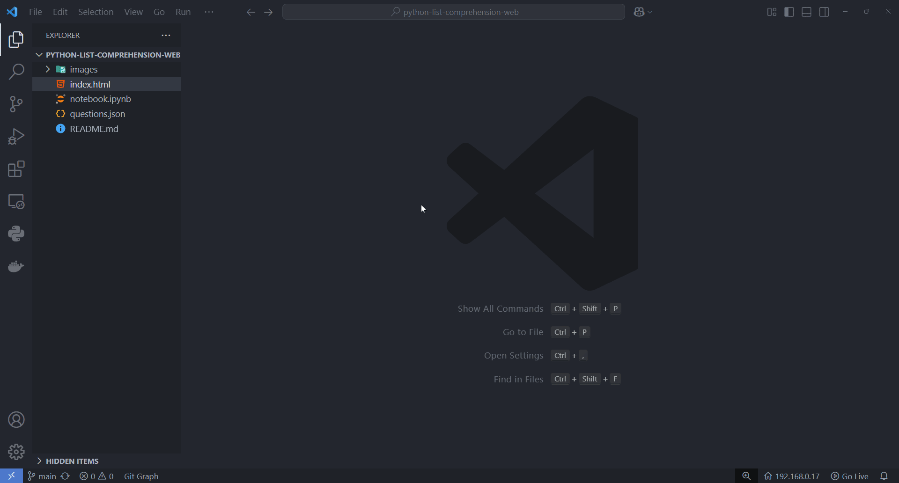
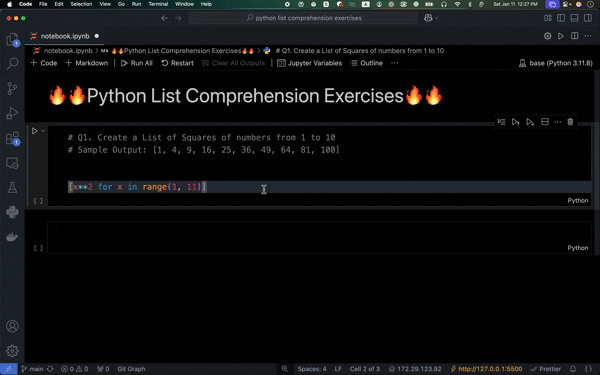

# 🔥 Python List Comprehension Exercises

Inspired by <a href='https://www.tutorjoes.in/python_programming_tutorial/list_comprehensions_exercises_in_python#google_vignette'> Tutor Joe's Stanley</a>

**Python 리스트 컴프리헨션 연습 문제** 도장에 오신 것을 환영합니다! 🚀  
이 인터랙티브 웹 페이지는 Python의 리스트 컴프리헨션을 연습하고 마스터하기 위한 다양한 문제를 제공합니다. 
문제는 **쉬움**부터 **어려움**까지 세 가지 난이도로 구성되어 있습니다.

## 주요 기능

- **Python 리스트 컴프리헨션 연습 문제 40개**
  - **Easy** (문제 10개, 초록색 테마) 🟢
  - **Medium** (문제 10개, 노란색 테마) 🟡
  - **Hard** (문제 20개, 빨간색 테마) 🔴
- 각 문제에 대한 샘플 출력 제공.
- "솔루션 보기" 버튼으로 정답을 숨기거나 볼 수 있음.
- 깔끔하고 반응형인 UI 디자인.

## 화면

문제 해설 확인 `index.html`

코딩 실습 `notebook.ipynb`

## 설치

1. VS Code 설치
2. VS Code의 확장 기능에서 "Jupyter" 설치.
3. VS Code의 "Live Server" 설치

## 사용 방법

1. VS 코드에서 `index.html`를 Live Server로 열기
2. `notebook.ipynb`에서 연습하기
